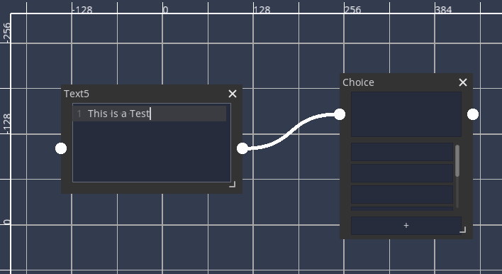
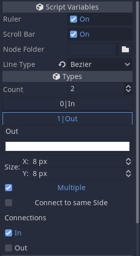
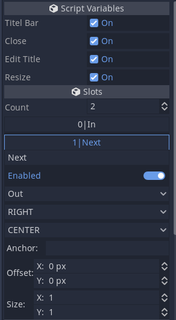

# ShyGraph

A Godot Plugin that adds a Custom Graph Edit

## Main Functions

- Slots on all four sides
- alligning the slots to child nodes or to the node itself
- breaking connections via a break line
- creating  nodes directly in the Editor
- undo redo
- theme support
- line types
  - direct lines
  - bezier curves

## How to use

add the ShyGraphEdit node or a Control node extending it to the scene
use the add button in the toolbar to add a Node
	or add it manualy
add some Controls to the Node
	they must extend ShyGraphNode
add slot types via the inspector while editing a ShyGraphEdit
	it helps to reselect the ShyGraphEdit to update the type names in the inspector

assing the wanted connections
then add the slots to the nodes via the inspector from the ShyGraphNode

